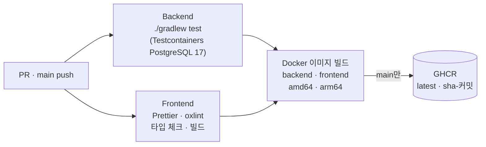

# StoreFlow ERP

[](https://github.com/Nick-ugi/storeflow-erp/actions/workflows/ci.yml)

판매·재고·발주 통합 관리 시스템 — *Legacy ERP → Modern Web Architecture*

소규모 매장의 상품, 판매, 재고, 발주 및 입고 업무를 통합 관리하는 Web ERP 시스템

## 1. Project Overview

> 작성 예정

## 2. Background

> 작성 예정 — AS400 / RPG / DB2 기반 레거시 업무 시스템 분석 경험을 Web 아키텍처로 재설계

## 3. Goals

> 작성 예정

## 4. Main Features

> 작성 예정 — 회원/권한, 상품, 판매, 재고, 발주, Dashboard

## 5. System Architecture

> 작성 예정

## 6. Tech Stack

| 구분 | 기술 |
|---|---|
| Frontend | React 19, TypeScript 6, Vite 8, Ant Design 6, TanStack Query 5, React Router 8, zustand, Recharts |
| Backend | Java 21, Spring Boot 4.0, Spring Security (JWT · OAuth2 Resource Server), MyBatis |
| Database | PostgreSQL 17, Flyway |
| Test | JUnit 5, MockMvc, Testcontainers (실제 PostgreSQL로 통합 · 동시성 테스트 90건) |
| Infra | Docker (멀티 스테이지 빌드), Docker Compose, Nginx, GitHub Actions |

## 7. ERD

> 작성 예정 — [docs/erd](docs/erd)

## 8. Business Flow

> 작성 예정 — [docs/flow](docs/flow)

## 9. API Documentation

> 작성 예정 — [docs/api](docs/api)

## 10. Authentication

- **JWT (Access Token 8시간)** — Spring Security OAuth2 Resource Server로 서명(HS256) · 만료를 검증
- **토큰에는 사용자 ID만** 담고, 요청마다 DB에서 사용자의 활성 상태 · 역할 · 소속 매장을 다시 읽는다
  → 사용자를 비활성화하거나 역할을 바꾸면 이미 발급된 토큰에도 **다음 요청부터 바로 반영**
- **권한 = 역할 + 매장 범위**
  - 역할: 컨트롤러 메서드별 `@PreAuthorize` (예: 판매 취소는 ADMIN · MANAGER)
  - 매장 범위: `LoginUser`가 한곳에서 처리 — MANAGER · USER는 요청의 `storeId`와 관계없이 소속 매장으로 고정, 다른 매장 상세는 403
- ADMIN 보호: 본인 역할 · 상태 변경 금지, 활성 ADMIN 행을 잠가 동시에 서로를 강등해도 마지막 ADMIN이 남음

## 11. Transaction Processing

### 재고 변경 공통 절차

재고는 **판매 · 판매 취소 · 입고 · 조정** 네 업무에서만 바뀌며, 모두 `StockService.change()` 하나를 거친다.

```
호출한 업무의 트랜잭션 안에서 (MANDATORY)
 1. 재고 행을 상품 ID 오름차순으로 잠금      SELECT … ORDER BY product_id FOR UPDATE
 2. 변동 후 수량 = 변동 전 + 변동 수량       0 미만이면 INSUFFICIENT_STOCK → 업무 전체 롤백
 3. 재고 수량 변경 + 재고 이력 1건 기록      (유형, 변동 전 · 후 수량, 관련 판매 · 발주번호, 처리자)
```

| 업무 | 하나의 트랜잭션에 포함되는 처리 |
|---|---|
| 판매 등록 | 판매 · 판매 상세 저장 → 재고 차감 · 이력 (단가는 서버의 현재 판매가) |
| 판매 취소 | '완료'일 때만 '취소'로 조건부 변경 → 재고 복원 · 이력 |
| 발주 입고 | 발주 행 잠금 · '승인' 확인 → '입고완료' 변경 → 재고 증가 · 이력 |
| 재고 조정 | 재고 증감 · 이력 (사유 필수) |

### 동시성 처리

| 상황 | 방법 | 검증 테스트 |
|---|---|---|
| 남은 재고 1개를 두 판매가 동시에 요청 | 재고 행 잠금 → 나중 요청은 최신 수량을 보고 실패 | 재고 10개에 20건 동시 판매 → 정확히 10건 성공 |
| 여러 상품 판매가 서로 다른 순서로 잠금 | 항상 상품 ID 오름차순으로 잠가 교착 상태 방지 | 상품 순서를 뒤집은 판매 10건 동시 처리 |
| 같은 판매를 동시에 두 번 취소 | `WHERE status = 'COMPLETED'` 조건부 UPDATE | 재고는 한 번만 복원 |
| 같은 발주에 입고와 취소가 동시에 | 발주 행 잠금 후 상태 확인 | 하나만 성공, 재고가 최종 상태와 일치 |

- 잠금이나 조건을 **일부러 제거하면 위 테스트가 실패**하는 것을 확인했다 (뮤테이션 테스트)
- DB 제약조건이 마지막 방어선: 재고 음수 금지, 이력의 `변동 후 = 변동 전 + 변동 수량`, 발주 상태별 필수 일시

## 12. Docker

배포용 구성은 [docker/](docker)에 있다. 외부에는 Nginx 포트 하나만 열고, DB · 백엔드는 compose 내부 네트워크에서만 접근한다.

```
브라우저 ──:80──▶ frontend (Nginx)
                   ├─ /        React 빌드 결과 (화면 경로는 index.html → React Router)
                   └─ /api/*  ──▶ backend (Spring Boot :8080) ──▶ db (PostgreSQL :5432, 볼륨 db-data)
```

| 이미지 | 빌드 단계 | 실행 단계 |
|---|---|---|
| `storeflow-backend` | JDK 21로 `bootJar` → Spring Boot 레이어별 추출 | JRE 21 (alpine), root가 아닌 사용자로 실행 |
| `storeflow-frontend` | Node 24로 타입 체크 + Vite 빌드 | Nginx 1.30 (alpine) |

- **비밀값은 환경변수로만** — `docker/.env`(Git 제외)에 `DB_PASSWORD` · `JWT_SECRET`이 없으면 compose가 실행을 거부한다. 컨테이너는 `prod` 프로필로 실행되어 개발용 JWT 키를 쓰지 않는다 (로컬 개발 서버에서 받은 토큰은 401)
- **기동 순서** — DB healthcheck(`pg_isready`) → 백엔드 healthcheck(`/actuator/health`) → Nginx. 첫 기동 때 Flyway가 스키마와 초기 ADMIN을 만든다
- **actuator 비공개** — Nginx는 `/api/`만 백엔드로 전달한다. 헬스체크는 컨테이너 안에서만 호출
- **레이어 분리** — 의존성(36MB)과 애플리케이션 코드(약 200KB)를 다른 레이어로 복사해, 코드만 바뀌면 작은 레이어만 새로 받는다
- **캐시** — 파일명에 해시가 붙은 `/assets/*`는 1년(immutable), `index.html`은 매번 확인(no-cache) → 재배포하면 바로 새 화면. 없는 빌드 파일은 index.html 대신 404
- **보안 헤더** — CSP(`script-src 'self'`), `X-Frame-Options`, `nosniff`, `Referrer-Policy`. API 응답의 보안 헤더는 Spring Security가 붙이므로 Nginx에서 중복하지 않는다
- **백엔드 재생성 대응** — Nginx upstream이 백엔드 이름을 주기적으로 다시 조회(`resolve`)해, 백엔드 컨테이너를 새로 만들어 IP가 바뀌어도 Nginx 재시작 없이 연결된다 (IP를 바꿔 확인)
- **자원** — 백엔드 컨테이너 메모리 768MB 상한, JVM 힙은 그 75%. 컨테이너 로그는 10MB × 3개로 순환

```bash
cp docker/.env.example docker/.env                            # DB_PASSWORD, JWT_SECRET 입력
docker compose -f docker/docker-compose.yml up -d --build     # http://localhost
docker compose -f docker/docker-compose.yml logs -f backend
docker compose -f docker/docker-compose.yml exec db psql -U storeflow   # DB 직접 확인
docker compose -f docker/docker-compose.yml down              # 중지 (데이터 유지, -v를 붙이면 삭제)
```

## 13. CI/CD

GitHub Actions — [.github/workflows/ci.yml](.github/workflows/ci.yml). PR과 main push마다 실행한다.



| 작업 | 내용 |
|---|---|
| Backend | 통합 · 동시성 테스트 전체를 실제 PostgreSQL 컨테이너로 실행. 실패하면 테스트 리포트를 아티팩트로 올린다 |
| Frontend | 포맷 · lint(경고도 실패) · 타입 체크 · 빌드 |
| Docker | 두 검사가 모두 통과해야 실행. main이면 `ghcr.io/nick-ugi/storeflow-{backend,frontend}`에 `latest` · `sha-<커밋>` 태그로 올린다 (PR은 빌드 확인만) |

- **테스트를 통과한 커밋만 이미지가 된다** — 배포는 GHCR 이미지를 받아 실행하므로 검증되지 않은 코드가 서버에 올라가지 않는다. `sha-` 태그로 특정 커밋 버전으로 되돌릴 수 있다
- **멀티 아키텍처** — jar · 정적 파일 빌드는 빌드 머신에서 한 번만 하고(`--platform=$BUILDPLATFORM`), arm64는 실행 이미지만 조립한다. 에뮬레이션으로 컴파일하지 않아 arm64를 추가해도 빌드 시간이 크게 늘지 않는다
- **캐시** — Gradle · npm 의존성, Docker 레이어(GitHub Actions 캐시)
- **권한 최소화** — 워크플로 기본 권한은 `contents: read`, 이미지를 올리는 작업만 `packages: write`. 레지스트리 인증은 실행마다 발급되는 `GITHUB_TOKEN`을 사용 (별도 비밀값 없음)
- 같은 브랜치에 새 커밋이 오면 진행 중인 이전 실행은 취소한다

## 14. Deployment

> 작성 예정

## 15. Troubleshooting

### 비활성화한 사용자의 토큰이 계속 통과함 — MyBatis 1차 캐시

- **문제**: 사용자를 비활성화한 뒤에도 같은 트랜잭션 안의 다음 요청에서 인증이 통과함 (통합 테스트에서 발견)
- **원인**: MyBatis 기본 설정(`localCacheScope=SESSION`)은 같은 SqlSession 안에서 동일한 조회 결과를 캐시한다. JDBC로 바뀐 사용자 상태를 MyBatis가 다시 읽지 않고 캐시 값을 돌려줌
- **해결**: `mybatis.configuration.local-cache-scope: statement` — 조회마다 DB를 다시 읽도록 변경
- **결과**: 인증뿐 아니라 한 트랜잭션에서 재고를 다시 읽는 판매 · 입고 처리에서도 오래된 값을 읽을 위험을 제거

### 롤백 테스트가 항상 실패함 — 테스트 트랜잭션과 서비스 트랜잭션

- **문제**: "재고 부족 시 판매 전체 롤백" 테스트에서 실패한 판매 데이터가 조회됨
- **원인**: `@Transactional` 테스트 안에서는 서비스 트랜잭션이 테스트 트랜잭션에 참여한다. 예외가 나도 롤백 표시만 되고 실제 롤백은 테스트가 끝날 때 일어나므로, 같은 트랜잭션에서는 저장된 행이 보임
- **해결**: 실제 커밋 · 롤백이 필요한 테스트(롤백, 동시성)는 테스트 트랜잭션 없이 실행하는 `RealTransactionTestSupport`로 분리하고, 테스트 후 데이터를 정리
- **결과**: 롤백 · 동시성 규칙을 실제 트랜잭션으로 검증. 잠금(`FOR UPDATE`)이나 조건부 취소를 일부러 제거하면 해당 테스트가 실패하는 것도 확인 (뮤테이션 테스트)

## 16. Lessons Learned

> 작성 예정

---

## Getting Started (로컬 개발 환경)

**필요 도구:** JDK 21, Node.js 22.22+, Docker Desktop

```bash
# 1. DB 실행 (PostgreSQL 17)
docker compose up -d

# 2. Backend 실행 → http://localhost:8080
cd backend
./gradlew bootRun

# 3. Frontend 실행 → http://localhost:5173
cd frontend
npm install
npm run dev
```

브라우저에서 http://localhost:5173 접속 → 아래 초기 ADMIN 계정으로 로그인하면 Dashboard가 열린다.
ADMIN으로 매장 · 상품 · 공급처 · 사용자(MANAGER · USER)를 등록하면 역할별 화면을 확인할 수 있다.
DB 접속 정보는 [.env.example](.env.example) 참고.

- **초기 ADMIN 계정**: 아이디 `admin` / 비밀번호 `admin1234` (첫 실행 시 Flyway가 생성, 로그인 후 변경 권장)
- **테스트**: `cd backend && ./gradlew test` — Testcontainers가 테스트용 PostgreSQL 컨테이너를 따로 띄우므로 Docker가 실행 중이어야 한다.
- **운영 실행 시**: `JWT_SECRET` 환경변수(32자 이상)를 반드시 지정한다. 로컬 프로필(`local`)에서만 개발용 키를 사용한다.
- **Docker로 전체 실행**: JDK · Node 없이 Docker만으로 DB · 백엔드 · Nginx를 함께 띄울 수 있다 → [12. Docker](#12-docker)
