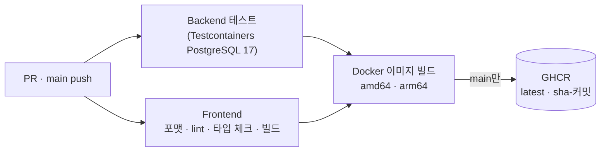

# StoreFlow ERP

[](https://github.com/Nick-ugi/storeflow-erp/actions/workflows/ci.yml)

본사와 여러 매장을 운영하는 소규모 유통 사업자를 위한 판매·재고·발주 관리 시스템입니다.
판매나 입고가 일어나면 재고와 재고 이력이 같은 트랜잭션 안에서 함께 바뀌도록 만들어, 업무 데이터와 재고 수량이 어긋나지 않게 하는 것을 가장 중요하게 봤습니다.

## 만든 이유

회사에서 AS400(RPG·DB2)으로 된 판매·재고 업무를 Web 환경으로 옮기는 일을 했습니다. 레거시 프로그램을 하나씩 분석하다 보니, 판매 한 건이 재고·이력·매출에 어떻게 이어지는지 같은 업무 규칙은 대부분 코드 속에 흩어져 있었습니다.

그때 익힌 업무 흐름을 바탕으로, 같은 도메인을 처음부터 제 방식대로 설계해 보고 싶었습니다. 요구사항 정의서와 테이블·API 명세를 먼저 확정하고 그대로 구현했고, 동시에 여러 요청이 들어와도 재고가 틀어지지 않는지를 테스트로 확인하는 데 시간을 많이 썼습니다.

## 주요 기능

사용자 역할은 본사 관리자(ADMIN), 매장 관리자(MANAGER), 매장 직원(USER) 세 가지입니다. 상품·카테고리·공급처는 본사가 관리하는 공통 정보이고, 재고·판매·발주는 매장별로 관리합니다.

| 업무 | 기능 |
|---|---|
| 인증 | 로그인, 로그아웃, 내 정보 조회 |
| 매장 · 사용자 | 매장 등록/수정/사용 중지, 계정 등록/수정/비활성화 (회원가입 없이 ADMIN이 생성) |
| 기준정보 | 카테고리, 상품, 공급처 관리 |
| 판매 | 판매 등록, 조회, 취소 |
| 재고 | 재고 조회, 재고 이력, 재고 조정, 안전재고 설정, 부족 재고 조회 |
| 발주 | 발주 등록/수정/승인/입고/취소, 조회 |
| Dashboard | 매출 현황, 재고 부족 현황, 최근 판매·발주 |

백엔드 API는 51개입니다.

## 기술 스택

| 구분 | 기술 |
|---|---|
| Frontend | React 19, TypeScript, Vite, Ant Design, TanStack Query, React Router, zustand, Recharts |
| Backend | Java 21, Spring Boot 4.0, Spring Security (JWT, OAuth2 Resource Server), MyBatis |
| Database | PostgreSQL 17, Flyway |
| Test | JUnit 5, MockMvc, Testcontainers |
| Infra | Docker, Docker Compose, Nginx, GitHub Actions, GHCR |

## 설계 문서

코드를 쓰기 전에 아래 문서를 먼저 확정했습니다. 테이블명, 컬럼명, 코드값, API 경로를 바꿔야 할 때는 문서를 먼저 고치고 코드에 반영하는 방식으로 진행했습니다. 전체 목록은 [docs/README.md](docs/README.md)에 있습니다.

- [요구사항 정의서](docs/requirements/01-requirements.md) · [화면 목록](docs/requirements/02-screens.md)
- [테이블 정의서](docs/erd/01-table-definition.md) · [ERD](docs/erd/02-erd.md) · [코드 정의서](docs/erd/03-code-definition.md)
- [API 공통 규칙](docs/api/01-api-common.md) · [API 목록](docs/api/02-api-list.md)
- [구동 흐름 (개발자용)](docs/architecture/01-runtime-flow.md) — 기동, 요청 처리, 인증, 재고 트랜잭션과 잠금 순서

## 인증과 권한

JWT(Access Token 8시간)를 쓰고, 서명과 만료 검증은 Spring Security의 OAuth2 Resource Server에 맡겼습니다.

토큰에는 사용자 ID만 넣고, 활성 상태·역할·소속 매장은 요청마다 DB에서 다시 읽습니다. 그래서 관리자가 사용자를 비활성화하거나 역할을 바꾸면, 이미 발급된 토큰이라도 다음 요청부터 바로 적용됩니다.

권한은 두 가지로 나눠서 봅니다.

- 무엇을 할 수 있는지: 역할 기준으로 컨트롤러 메서드마다 `@PreAuthorize`를 붙였습니다. 예를 들어 판매 취소는 ADMIN과 MANAGER만 할 수 있습니다.
- 어느 매장 데이터인지: `LoginUser` 한곳에서 처리합니다. MANAGER와 USER는 요청에 어떤 `storeId`를 보내도 소속 매장으로 고정되고, 다른 매장의 상세 데이터를 요청하면 403을 돌려줍니다.

ADMIN은 자기 자신의 역할이나 상태를 바꿀 수 없게 막았습니다. 두 ADMIN이 동시에 서로를 강등하는 경우도 활성 ADMIN 행을 잠가서 처리하기 때문에, 마지막 ADMIN 한 명은 항상 남습니다.

## 재고 처리와 동시성

재고는 판매, 판매 취소, 입고, 재고 조정 네 가지 업무에서만 바뀌고, 네 업무 모두 `StockService.change()` 하나를 거칩니다. 이 메서드는 호출한 업무의 트랜잭션 안에서만 실행되도록 `MANDATORY`로 선언했고, 처리 순서는 다음과 같습니다.

1. 재고 행을 상품 ID 오름차순으로 잠급니다. (`SELECT … ORDER BY product_id FOR UPDATE`)
2. 변동 후 수량을 계산합니다. 0보다 작아지면 `INSUFFICIENT_STOCK` 오류를 내고 업무 전체를 롤백합니다.
3. 재고 수량을 바꾸고, 재고 이력을 한 건 남깁니다. (변동 유형, 변동 전·후 수량, 관련 판매·발주 번호, 처리자)

| 업무 | 한 트랜잭션 안에서 처리하는 내용 |
|---|---|
| 판매 등록 | 판매와 판매 상세 저장, 재고 차감과 이력 기록. 단가는 클라이언트 값이 아니라 서버의 현재 판매가를 씁니다. |
| 판매 취소 | 상태가 '완료'일 때만 '취소'로 바꾸고, 재고 복원과 이력 기록 |
| 발주 입고 | 발주 행을 잠그고 '승인' 상태인지 확인한 뒤 '입고완료'로 변경, 재고 증가와 이력 기록 |
| 재고 조정 | 재고 증감과 이력 기록 (사유 필수) |

동시에 요청이 몰리는 상황은 아래처럼 처리했고, 각각 실제 PostgreSQL에서 돌아가는 테스트로 확인했습니다.

| 상황 | 처리 방법 | 테스트 |
|---|---|---|
| 남은 재고 1개를 두 판매가 동시에 요청 | 재고 행 잠금. 나중 요청은 최신 수량을 보고 실패 | 재고 10개에 판매 20건 동시 요청 → 정확히 10건 성공 |
| 여러 상품을 파는 판매들이 서로 다른 순서로 잠금 | 항상 상품 ID 오름차순으로 잠가 교착 상태 방지 | 상품 순서를 뒤집은 판매 10건 동시 처리 |
| 같은 판매를 동시에 두 번 취소 | `WHERE status = 'COMPLETED'` 조건부 UPDATE | 재고는 한 번만 복원 |
| 같은 발주에 입고와 취소가 동시에 | 발주 행을 잠근 뒤 상태 확인 | 하나만 성공하고 재고가 최종 상태와 일치 |

잠금이나 조건을 일부러 빼면 위 테스트가 실패하는 것도 확인했습니다. 마지막 방어선으로 DB 제약조건도 걸어 두었습니다. 재고는 음수가 될 수 없고, 재고 이력은 항상 `변동 후 = 변동 전 + 변동 수량`을 만족해야 하며, 발주는 상태에 따라 필요한 일시 값이 있어야 합니다.

## Docker 배포 구성

배포용 설정은 [docker/](docker) 폴더에 있습니다. 외부에는 Nginx의 80 포트 하나만 열고, DB와 백엔드는 compose 내부 네트워크에서만 접근할 수 있습니다.

```
브라우저 ──:80──▶ frontend (Nginx)
                   ├─ /        React 빌드 결과 (없는 경로는 index.html → React Router)
                   └─ /api/*  ──▶ backend (Spring Boot :8080) ──▶ db (PostgreSQL :5432)
```

| 이미지 | 빌드 | 실행 |
|---|---|---|
| `storeflow-backend` | JDK 21로 `bootJar` 후 Spring Boot 레이어별로 추출 | JRE 21 (alpine), root가 아닌 사용자 |
| `storeflow-frontend` | Node 24로 타입 체크와 Vite 빌드 | Nginx (alpine) |

운영하면서 신경 쓴 부분은 이렇습니다.

- 비밀값은 환경변수로만 받습니다. `docker/.env`(Git 제외)에 `DB_PASSWORD`와 `JWT_SECRET`이 없으면 compose가 실행되지 않고, 컨테이너는 `prod` 프로필로 떠서 개발용 JWT 키를 쓰지 않습니다.
- 기동 순서는 DB 헬스체크(`pg_isready`), 백엔드 헬스체크(`/actuator/health`), Nginx 순입니다. 첫 기동 때 Flyway가 스키마와 초기 ADMIN 계정을 만듭니다.
- Nginx는 `/api/`만 백엔드로 넘기기 때문에 actuator는 외부에서 보이지 않습니다.
- 의존성(약 36MB)과 애플리케이션 코드(약 200KB)를 다른 레이어에 두어서, 코드만 바뀌었을 때는 작은 레이어만 새로 받습니다.
- 해시가 붙은 `/assets/*` 파일은 1년 캐시, `index.html`은 매번 확인하도록 해서 재배포 직후 바로 새 화면이 보입니다.
- 백엔드 컨테이너를 새로 만들어 IP가 바뀌어도, Nginx가 백엔드 이름을 주기적으로 다시 조회하기 때문에 Nginx를 재시작하지 않아도 됩니다.
- 백엔드 컨테이너 메모리는 768MB로 제한하고 JVM 힙은 그 75%로 잡았습니다.

```bash
cp docker/.env.example docker/.env                            # DB_PASSWORD, JWT_SECRET 입력
docker compose -f docker/docker-compose.yml up -d --build     # http://localhost
docker compose -f docker/docker-compose.yml logs -f backend
docker compose -f docker/docker-compose.yml down              # 중지 (데이터 유지, -v를 붙이면 삭제)
```

## CI/CD

[GitHub Actions](.github/workflows/ci.yml)가 PR과 main push마다 실행됩니다.



백엔드는 통합 테스트와 동시성 테스트 전체를 실제 PostgreSQL 컨테이너에서 돌리고, 프론트엔드는 포맷, lint(경고도 실패 처리), 타입 체크, 빌드를 확인합니다. 두 작업이 모두 통과해야 Docker 이미지를 만들고, main 브랜치일 때만 `ghcr.io/nick-ugi/storeflow-{backend,frontend}`에 `latest`와 `sha-<커밋>` 태그로 올립니다.

배포는 GHCR 이미지를 받아서 실행하기 때문에 테스트를 통과한 커밋만 서버에 올라갑니다. 문제가 생기면 `sha-` 태그로 특정 커밋 버전으로 되돌릴 수 있습니다. 그 밖에 이렇게 설정했습니다.

- arm64 이미지는 빌드 머신에서 만든 jar와 정적 파일로 실행 이미지만 조립합니다. 에뮬레이션으로 컴파일하지 않아서 빌드 시간이 크게 늘지 않습니다.
- Gradle·npm 의존성과 Docker 레이어는 GitHub Actions 캐시를 씁니다.
- 워크플로 기본 권한은 `contents: read`이고, 이미지를 올리는 작업만 `packages: write`를 받습니다. 레지스트리 인증은 실행마다 발급되는 `GITHUB_TOKEN`을 써서 따로 비밀값을 두지 않았습니다.

## 트러블슈팅

### 비활성화한 사용자의 토큰이 계속 통과하던 문제

통합 테스트를 하다가, 사용자를 비활성화했는데도 같은 트랜잭션 안의 다음 요청에서 인증이 통과하는 것을 발견했습니다.

원인은 MyBatis의 1차 캐시였습니다. 기본 설정(`localCacheScope=SESSION`)에서는 같은 SqlSession 안에서 같은 조회를 하면 DB를 다시 읽지 않고 캐시된 결과를 돌려줍니다. 그래서 바뀐 사용자 상태를 보지 못했습니다.

`mybatis.configuration.local-cache-scope`를 `statement`로 바꿔 조회할 때마다 DB를 읽도록 했습니다. 인증뿐 아니라, 한 트랜잭션 안에서 재고를 다시 읽는 판매·입고 처리에서 오래된 값을 읽을 위험도 같이 없어졌습니다.

### 롤백 테스트가 계속 실패하던 문제

"재고가 부족하면 판매 전체를 롤백한다"는 테스트에서, 실패한 판매 데이터가 계속 조회됐습니다.

테스트 메서드에 `@Transactional`을 붙이면 서비스 트랜잭션이 테스트 트랜잭션에 참여합니다. 예외가 나도 롤백 표시만 되고 실제 롤백은 테스트가 끝날 때 일어나기 때문에, 같은 트랜잭션 안에서는 저장된 행이 그대로 보였던 것입니다.

실제 커밋과 롤백이 필요한 테스트(롤백, 동시성)는 테스트 트랜잭션 없이 실행하는 `RealTransactionTestSupport`로 분리하고, 테스트가 끝나면 데이터를 직접 정리하도록 바꿨습니다.

## 로컬에서 실행하기

필요한 도구는 JDK 21, Node.js 22.22 이상, Docker Desktop입니다.

```bash
# 1. DB 실행 (PostgreSQL 17)
docker compose up -d

# 2. Backend 실행 → http://localhost:8080
cd backend
./gradlew bootRun

# 3. Frontend 실행 → http://localhost:5173
cd frontend
npm install
npm run dev
```

http://localhost:5173 에 접속해서 초기 ADMIN 계정(아이디 `admin`, 비밀번호 `admin1234`)으로 로그인하면 Dashboard가 열립니다. 이 계정은 첫 실행 때 Flyway가 만들고, 로그인한 뒤 비밀번호를 바꾸는 것을 권장합니다. ADMIN으로 매장, 상품, 공급처, 사용자(MANAGER, USER)를 등록하면 역할별 화면을 확인할 수 있습니다.

- DB 접속 정보를 바꾸려면 [.env.example](.env.example)을 `.env`로 복사해서 고치면 됩니다. `.env`는 Git에 올라가지 않고, 백엔드(local 프로필)와 개발용 docker compose가 함께 읽습니다.
- 테스트는 `cd backend && ./gradlew test`로 실행합니다. Testcontainers가 테스트용 PostgreSQL 컨테이너를 따로 띄우기 때문에 Docker가 켜져 있어야 합니다.
- 운영 환경에서는 `JWT_SECRET` 환경변수(32자 이상)를 꼭 지정해야 합니다. 개발용 키는 `local` 프로필에서만 씁니다.
- JDK나 Node 없이 Docker만으로 전체를 띄우려면 [Docker 배포 구성](#docker-배포-구성)을 보면 됩니다.
