# 구동 흐름 (개발자용)

코드가 **어떤 순서로, 어떤 클래스를 거쳐** 실행되는지 정리한 문서다.
업무 규칙(왜 그렇게 하는가)은 [상세 기능 명세](../requirements/), 요청 · 응답 형식은 [API 명세](../api/)를 본다.

- 표기: `클래스.메서드` — 백엔드는 `backend/src/main/java/com/storeflow/` 아래, 프론트엔드는 `frontend/src/` 아래 기준
- ★ 표시는 재고가 바뀌는 트랜잭션

| 장 | 내용 |
|---|---|
| 1 | [전체 구성](#1-전체-구성) |
| 2 | [백엔드 기동](#2-백엔드-기동) |
| 3 | [화면 진입 (프론트엔드 라우팅)](#3-화면-진입-프론트엔드-라우팅) |
| 4 | [API 요청 한 건의 처리](#4-api-요청-한-건의-처리) |
| 5 | [오류 처리](#5-오류-처리) |
| 6 | [인증 — 로그인 · 토큰 · 만료 · 로그아웃](#6-인증--로그인--토큰--만료--로그아웃) |
| 7 | [재고 변경 공통 절차 ★](#7-재고-변경-공통-절차-) |
| 8 | [판매 등록 ★](#8-판매-등록-) |
| 9 | [판매 취소 ★](#9-판매-취소-) |
| 10 | [발주 상태 전이와 입고 ★](#10-발주-상태-전이와-입고-) |
| 11 | [매장 · 상품 등록과 재고 행 생성](#11-매장--상품-등록과-재고-행-생성) |
| 12 | [트랜잭션 · 잠금 요약](#12-트랜잭션--잠금-요약) |
| 13 | [빌드 · 배포](#13-빌드--배포) |

---

## 1. 전체 구성

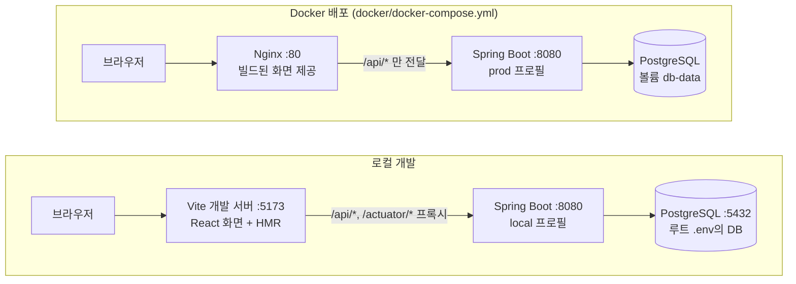

| 계층 | 위치 | 하는 일 |
|---|---|---|
| 화면 | `pages/*` | 입력 · 표시. 역할에 따라 메뉴 · 버튼을 숨김 (권한 판단은 서버) |
| 서버 데이터 | TanStack Query (`useQuery` · `useMutation`) | 조회 캐시, 등록 · 변경 후 `invalidateQueries()`로 전체 새로고침 |
| API 호출 | `api/*Api.ts` → `api/client.ts` | axios. 토큰 첨부, 오류를 `ApiError`로 변환 |
| 보안 | `common/config/SecurityConfig` | JWT 검증, 요청마다 사용자를 DB에서 다시 조회 |
| Controller | `{도메인}/controller` | URL, 역할 제한(`@PreAuthorize`), 입력 검증(`@Valid`) |
| Service | `{도메인}/service` | 업무 규칙, 트랜잭션(`@Transactional`), 매장 범위(`LoginUser`) |
| Mapper | `{도메인}/mapper` + `resources/mapper/*.xml` | SQL. `snake_case` ↔ `camelCase`, 일시는 KST(`+09:00`)로 변환 |
| DB | PostgreSQL 17 | 제약조건(마지막 방어선), 문서번호 시퀀스, 행 잠금 |

## 2. 백엔드 기동

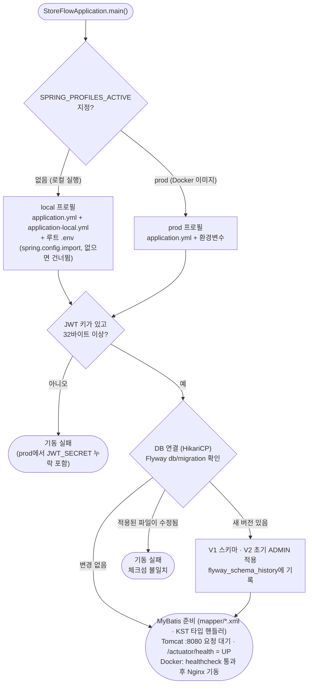

- 설정 값 우선순위: 환경변수 > 루트 `.env` > `application.yml` 기본값. (`DB_HOST` · `DB_PORT` · `DB_NAME` · `DB_USERNAME` · `DB_PASSWORD` · `JWT_SECRET`)
- 날짜 계산은 모두 주입받은 `Clock`(`ClockConfig`, Asia/Seoul) 기준이다. 서버 · DB의 시간대 설정과 관계없이 "오늘"이 한국 날짜로 계산된다.
- `local-cache-scope: statement` — 같은 트랜잭션 안에서도 조회할 때마다 DB를 다시 읽는다. 잠금 후 최신 수량을 읽어야 하는 재고 처리의 전제 조건이다.

## 3. 화면 진입 (프론트엔드 라우팅)

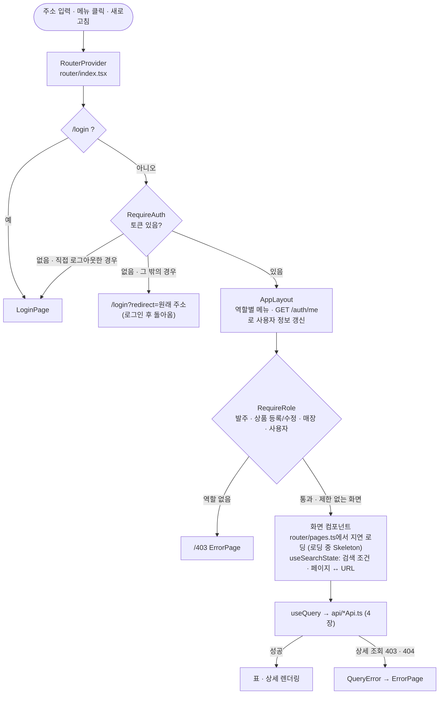

- 로그인 상태는 `stores/authStore.ts`(zustand)가 localStorage `storeflow-auth`에 보관한다. 새로고침해도 유지된다.
- 검색 조건이 URL에 있으므로 새로고침 · 뒤로 가기 · 주소 공유 시 같은 목록이 다시 보인다.

## 4. API 요청 한 건의 처리

판매 내역 조회(`GET /api/v1/sales`)를 예로 든 정상 흐름이다. 다른 API도 같은 경로를 지난다.

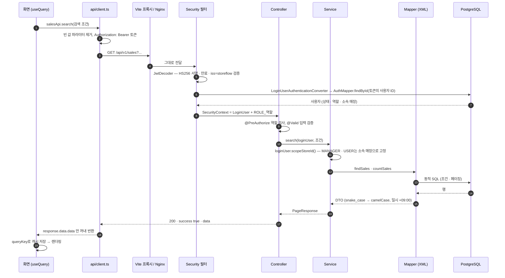

**매장 범위** — 컨트롤러는 요청의 `storeId`를 그대로 넘기고, 서비스가 `LoginUser`로 범위를 정한다.

| 메서드 | 쓰는 곳 | ADMIN | MANAGER · USER |
|---|---|---|---|
| `scopeStoreId(요청 storeId)` | 목록 · 집계 | 요청한 매장 (없으면 전 매장) | 항상 소속 매장 (요청 무시) |
| `requireStoreId(요청 storeId, 메시지)` | 등록 · 단일 매장 처리 | 필수 (없으면 400) | 항상 소속 매장 |
| `checkStoreAccess(문서의 storeId)` | 판매 · 발주 상세 · 처리 | 통과 | 다른 매장이면 403 |

## 5. 오류 처리

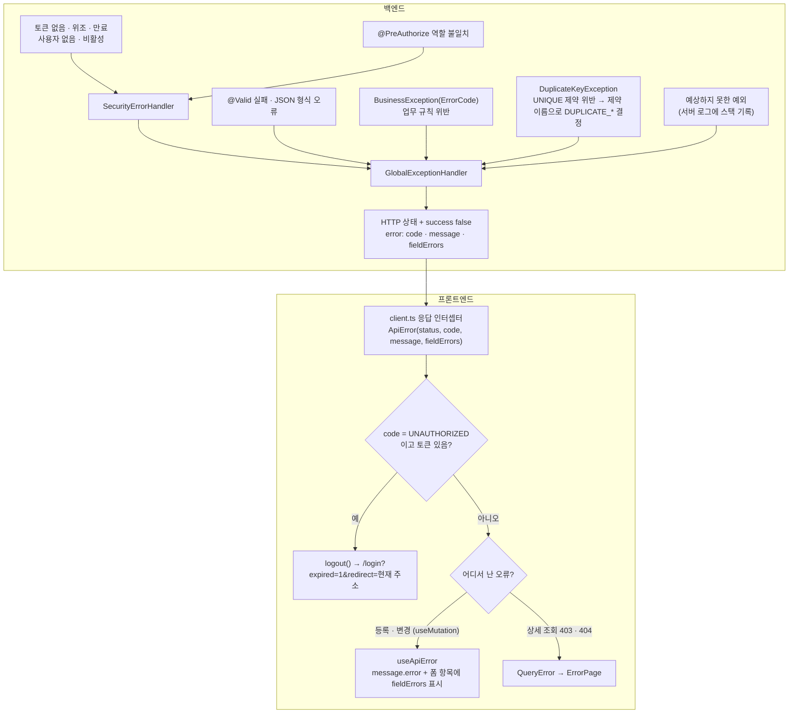

| 원인 | code | HTTP |
|---|---|---|
| 토큰 없음 · 위조 · 만료, 사용자 없음 · 비활성 | `UNAUTHORIZED` | 401 |
| 역할 없음, 다른 매장의 문서 | `FORBIDDEN` | 403 |
| 입력 검증 실패 (항목별 `fieldErrors` 포함) | `VALIDATION_ERROR` | 400 |
| 로그인 실패 — 코드가 `UNAUTHORIZED`가 아니므로 인터셉터가 로그아웃시키지 않음 | `LOGIN_FAILED` | 401 |
| 재고 부족 / 이미 취소된 판매 / 발주 상태 불일치 | `INSUFFICIENT_STOCK` / `SALE_ALREADY_CANCELLED` / `INVALID_PURCHASE_ORDER_STATUS` | 409 |
| 매장코드 · 아이디 · 상품코드 등 중복 | `DUPLICATE_*` | 409 |
| 그 밖의 예외 | `INTERNAL_ERROR` | 500 |

- `BusinessException`은 `RuntimeException`이므로 `@Transactional` 메서드 안에서 던지면 그 트랜잭션 전체가 롤백된다.
- 조회(`useQuery`)는 4xx면 재시도하지 않고, 네트워크 · 5xx 오류만 2번까지 재시도한다. (`main.tsx`)

## 6. 인증 — 로그인 · 토큰 · 만료 · 로그아웃

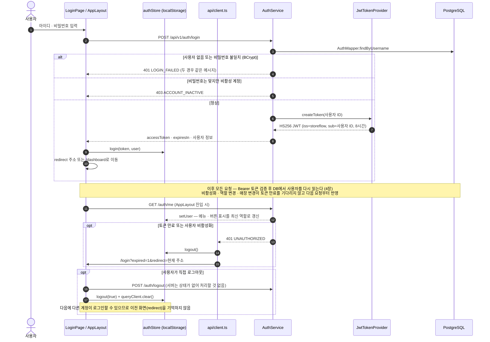

- 토큰에는 사용자 ID만 담는다. 역할 · 매장은 토큰이 아니라 DB에서 읽으므로 토큰을 위조해 역할을 바꿀 수 없다.
- 서명 키: local은 `application-local.yml`의 개발용 키, prod는 `JWT_SECRET` 환경변수. 서로 다른 키이므로 로컬에서 받은 토큰은 운영 서버에서 401이 된다.

## 7. 재고 변경 공통 절차 ★

재고 수량은 **`StockService.change()` 한 곳에서만** 바뀐다.

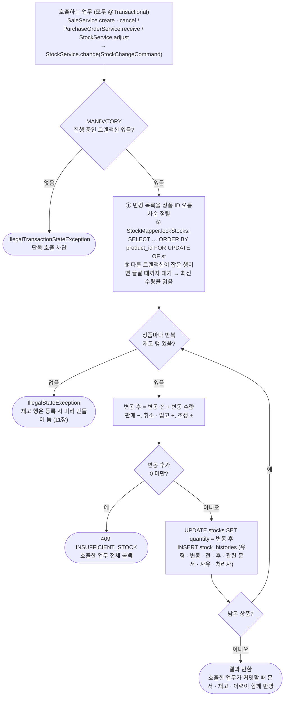

| 업무 | 명령 | 이력 유형 | 변동 수량 | 관련 문서 |
|---|---|---|---|---|
| 판매 등록 | `StockChangeCommand.sale` | `SALE` | − 판매 수량 | `SALE`, 판매 ID |
| 판매 취소 | `StockChangeCommand.saleCancel` | `SALE_CANCEL` | + 판매 수량 | `SALE`, 판매 ID |
| 입고 | `StockChangeCommand.purchase` | `PURCHASE` | + 발주 수량 | `PURCHASE_ORDER`, 발주 ID |
| 재고 조정 | `StockChangeCommand.adjustment` | `ADJUSTMENT` | ± 1 ~ 9,999 | 없음 (사유 필수) |

- **MANDATORY**: 이 메서드를 트랜잭션 없이 부르면 예외가 난다. "문서는 저장됐는데 재고는 안 바뀜" 같은 반쪽 처리를 구조적으로 막는다.
- **정렬 후 잠금**: 여러 상품을 다루는 요청들이 항상 같은 순서로 잠그므로 서로를 기다리는 교착 상태가 생기지 않는다.
- **DB 제약조건**: 코드가 잘못되어도 `ck_stocks_quantity`(재고 0 이상), `ck_stock_histories_quantity`(변동 후 = 변동 전 + 변동 수량), `ck_stock_histories_type`(유형별 부호 · 관련 문서)이 잘못된 값을 거부한다.

## 8. 판매 등록 ★

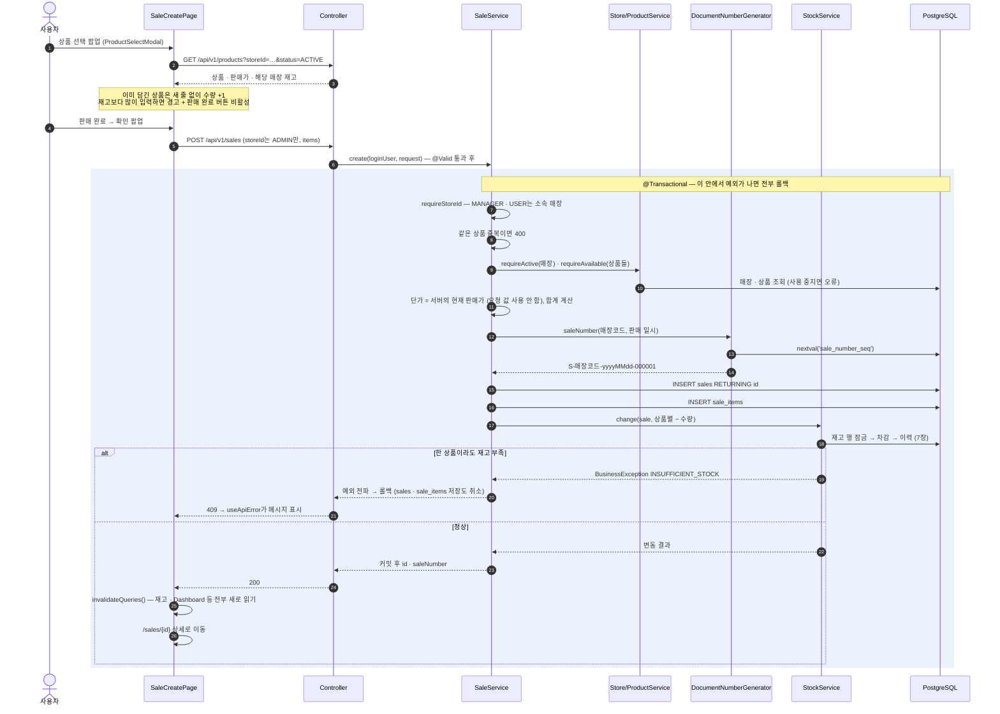

- 화면의 재고 경고는 팝업을 연 시점의 수량 기준이다. 최종 판단은 7장의 잠금 후 검사가 한다. (그 사이 다른 판매가 있으면 409)
- 롤백되어도 `nextval`로 받은 번호는 되돌리지 않는다. 번호 중간이 비는 것은 허용하고, 중복이 없는 것을 우선한다.

## 9. 판매 취소 ★

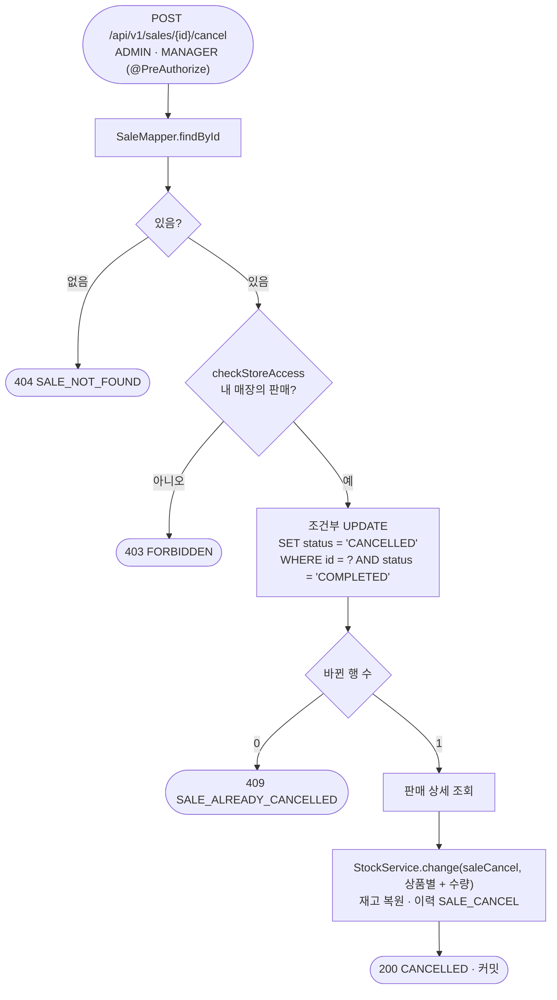

- **같은 판매를 동시에 두 번 취소하면**: 먼저 온 UPDATE가 행을 잠그고, 나중 UPDATE는 기다렸다가 바뀐 상태(`CANCELLED`)를 보고 0행 → 409. 재고는 한 번만 복원된다.
- 상태를 먼저 읽고 나중에 바꾸는 방식(조회 → 확인 → 변경)을 쓰지 않는 이유가 이것이다. 조회와 변경 사이에 다른 취소가 끼어들 수 있다.

## 10. 발주 상태 전이와 입고 ★

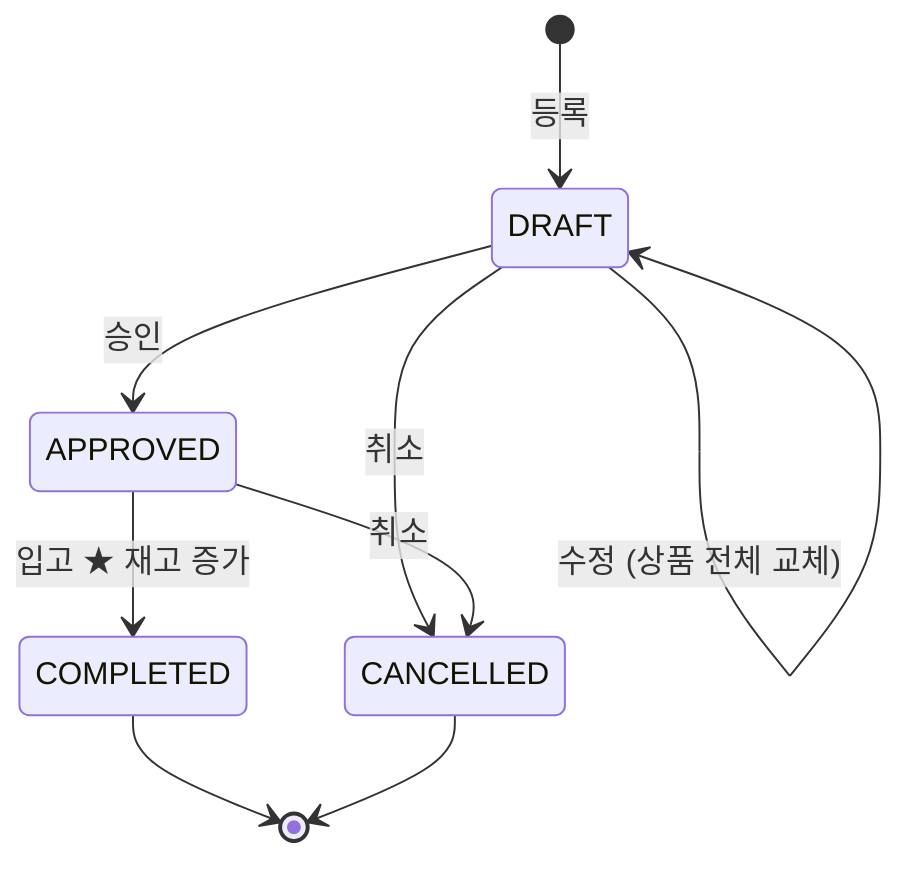

수정 · 승인 · 입고 · 취소는 모두 `PurchaseOrderService.lockInStatus()`로 시작한다. 허용 상태만 다르다.

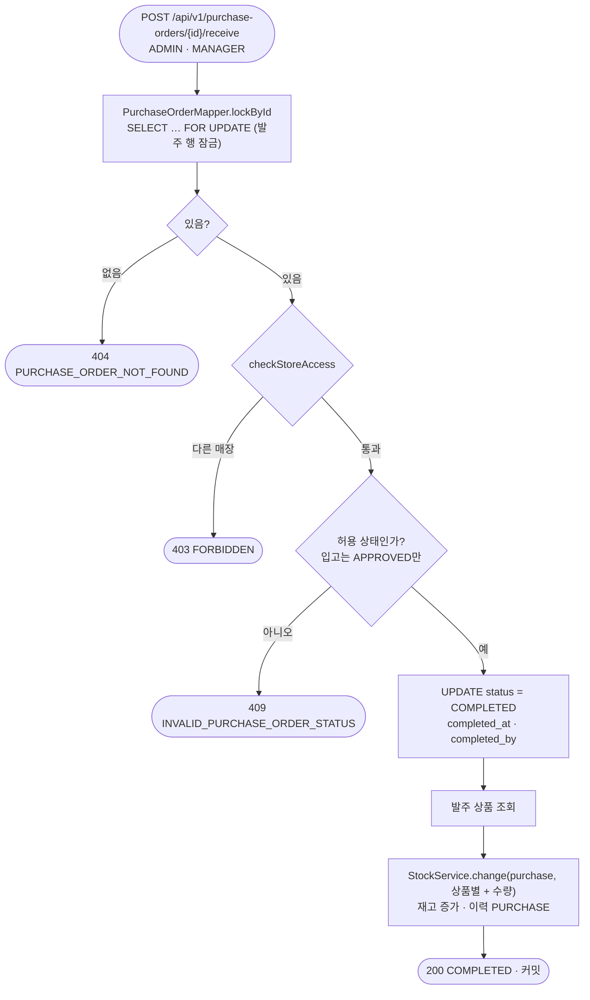

| 처리 | 허용 상태 | 결과 |
|---|---|---|
| 수정 `PUT /{id}` | `DRAFT` | 발주 상품 전체 삭제 후 다시 저장, 합계 재계산 |
| 승인 `/approve` | `DRAFT` | `APPROVED` |
| 입고 `/receive` | `APPROVED` | `COMPLETED` + 재고 증가 |
| 취소 `/cancel` | `DRAFT`, `APPROVED` | `CANCELLED` |

- **입고와 취소가 동시에 오면**: 먼저 잠근 쪽이 처리하고, 나중 요청은 잠금이 풀린 뒤 바뀐 상태를 보고 409가 된다.
- 입고는 매장 · 상품이 그 사이 사용 중지되어도 처리한다. 이미 주문해서 도착한 물건이기 때문이다. 등록 · 수정 때만 사용 여부를 검사한다.

## 11. 매장 · 상품 등록과 재고 행 생성

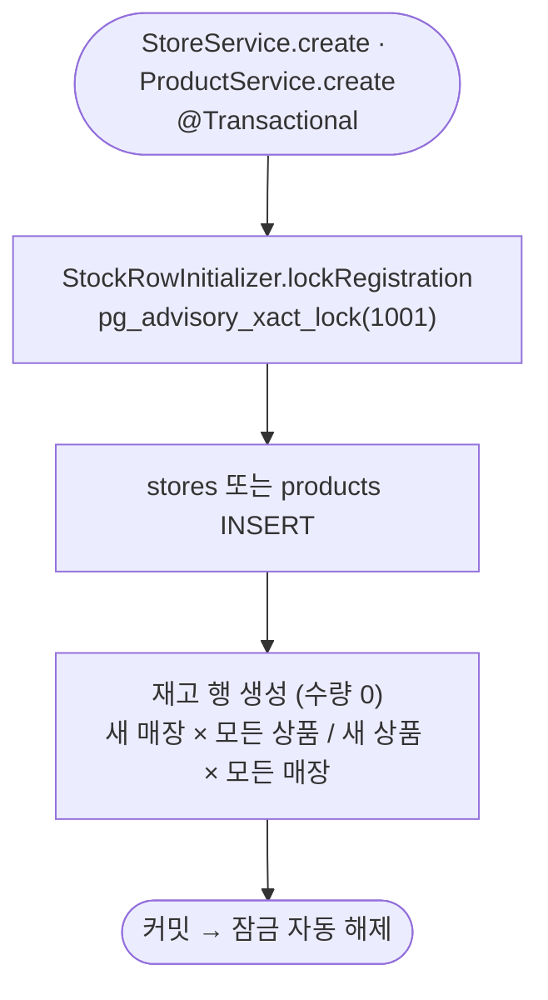

- 매장 등록과 상품 등록이 잠금 없이 동시에 실행되면 서로의 커밋 전 데이터를 보지 못해 그 조합의 재고 행이 빠진다. 등록 작업끼리만 이 잠금으로 줄을 세운다.
- 그 결과 `stocks`에는 항상 매장 × 상품의 모든 조합이 있다. 그래서 7장은 행을 만들 필요 없이 **잠그기만** 하면 된다.

## 12. 트랜잭션 · 잠금 요약

| 상황 | 잠그는 대상 | 방법 | 동시에 요청하면 |
|---|---|---|---|
| 재고 변경 (판매 · 취소 · 입고 · 조정) | `stocks` 행 | `FOR UPDATE`, 상품 ID 오름차순 | 나중 요청은 대기 후 최신 수량으로 계산 → 부족하면 409 |
| 판매 취소 | `sales` 행 | 조건부 UPDATE (`WHERE status = 'COMPLETED'`) | 한 번만 성공, 재고 한 번만 복원 |
| 발주 수정 · 승인 · 입고 · 취소 | `purchase_orders` 행 | `FOR UPDATE` 후 상태 확인 | 하나만 성공 |
| 매장 · 상품 등록 | advisory lock `1001` | `pg_advisory_xact_lock` | 순서대로 실행, 재고 행 누락 없음 |
| ADMIN 강등 · 비활성화 | 활성 ADMIN 행 전체 | `FOR UPDATE` (`UserMapper.lockActiveAdminIds`) | 동시에 서로를 강등해도 활성 ADMIN 1명 이상 유지 |

- **잠금 순서는 항상 문서(판매 · 발주) → 재고(상품 ID 오름차순)** — 모든 업무가 같은 순서를 지키므로 교착 상태가 생기지 않는다.
- 위 동작은 `RealTransactionTestSupport`를 상속한 동시성 테스트가 실제 트랜잭션으로 검증한다. 잠금이나 조건을 지우면 해당 테스트가 실패한다.

## 13. 빌드 · 배포

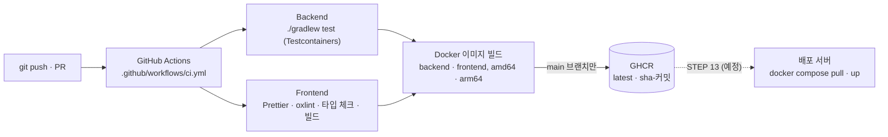

- 이미지 구성 · Nginx 설정은 [README 12장](../../README.md#12-docker), CI 설정은 [README 13장](../../README.md#13-cicd)을 본다.
