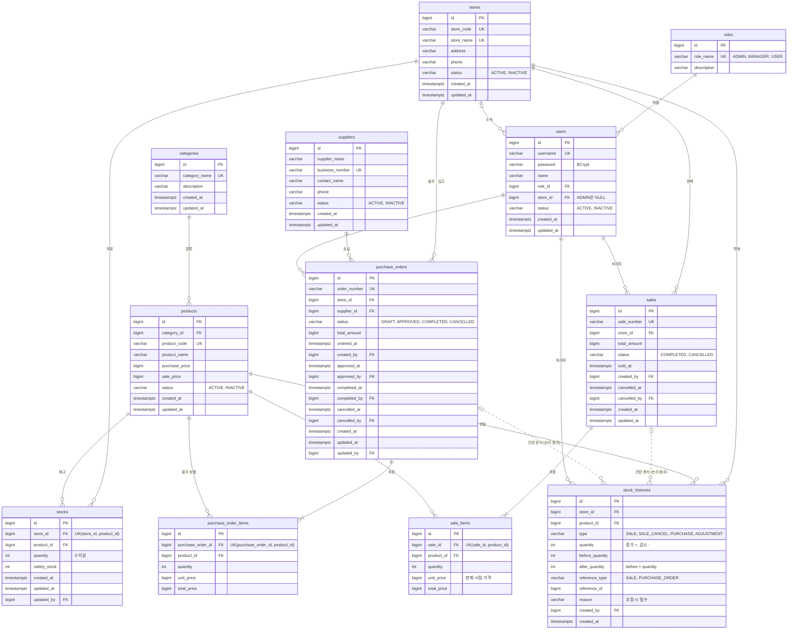

# StoreFlow ERP ERD

| 항목 | 내용 |
|---|---|
| 문서 버전 | v1.0 |
| 작성일 | 2026-09-25 |
| 상태 | 확정 |
| 관련 문서 | [테이블 정의서](01-table-definition.md), [코드 정의서](03-code-definition.md), [schema.sql](schema.sql) |

---

## 1. 전체 ERD



- 실선: FK로 연결된 관계 / 점선: FK 없이 `reference_type` + `reference_id`로 연결되는 논리 참조
- 처리자 관계는 대표 3개(판매 처리자, 발주 작성자, 재고 이력 처리자)만 그렸다. 전체 처리자 컬럼은 [테이블 정의서](01-table-definition.md)를 참고한다.

---

## 2. 영역별 구조

```
[기준정보 — 전 매장 공통]          [매장별 업무 데이터]
roles ──< users >── stores ────┬──< stocks >──────────┐
                                ├──< stock_histories >─┤
categories ──< products ────────┤                      │
                                ├──< sales ──< sale_items
suppliers ──────────────────────┴──< purchase_orders ──< purchase_order_items
```

| 영역 | 테이블 | 특징 |
|---|---|---|
| 기준정보 | `roles`, `stores`, `users`, `categories`, `products`, `suppliers` | 삭제하지 않고 상태로 관리 |
| 재고 | `stocks`, `stock_histories` | `stocks`는 매장 × 상품별 현재 값, `stock_histories`는 변경 기록 (추가만 가능) |
| 판매 | `sales`, `sale_items` | 판매 시점 단가 저장 |
| 발주 | `purchase_orders`, `purchase_order_items` | 상태별 처리 일시 · 처리자 기록 |

---

## 3. 핵심 관계

| 관계 | 카디널리티 | 설명 |
|---|---|---|
| `stores` — `stocks` — `products` | N : M (재고로 연결) | 매장 × 상품 조합마다 재고 1행 (`uk_stocks_store_id_product_id`) |
| `sales` — `sale_items` | 1 : N (1개 이상) | 판매 1건에 상품 1~50개 |
| `purchase_orders` — `purchase_order_items` | 1 : N (1개 이상) | 발주 1건에 상품 1~50개 |
| `stores` — `users` | 0..1 : N | ADMIN은 소속 매장 없음 |
| `sales` / `purchase_orders` — `stock_histories` | 1 : N (논리) | 판매 · 취소 · 입고 1건이 상품 수만큼 이력을 남김 |

### 판매 1건이 만드는 데이터

```
sales (1)  ──<  sale_items (N)
   │
   └─ 트랜잭션 안에서 함께 ─▶  stocks (N행 수량 감소)
                              stock_histories (N행 추가, type = SALE, reference = 이 판매)
```

---

## 변경 이력

| 버전 | 날짜 | 내용 |
|---|---|---|
| v0.1 | 2026-09-25 | 초안 작성 |
| v1.0 | 2026-09-25 | 확정 (검토 사항 초안대로 결정) |
